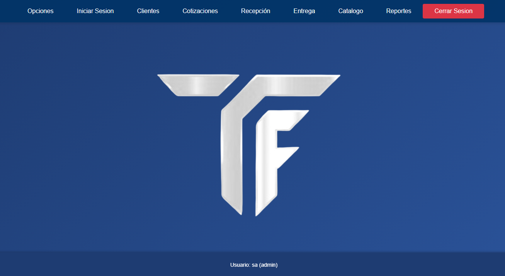
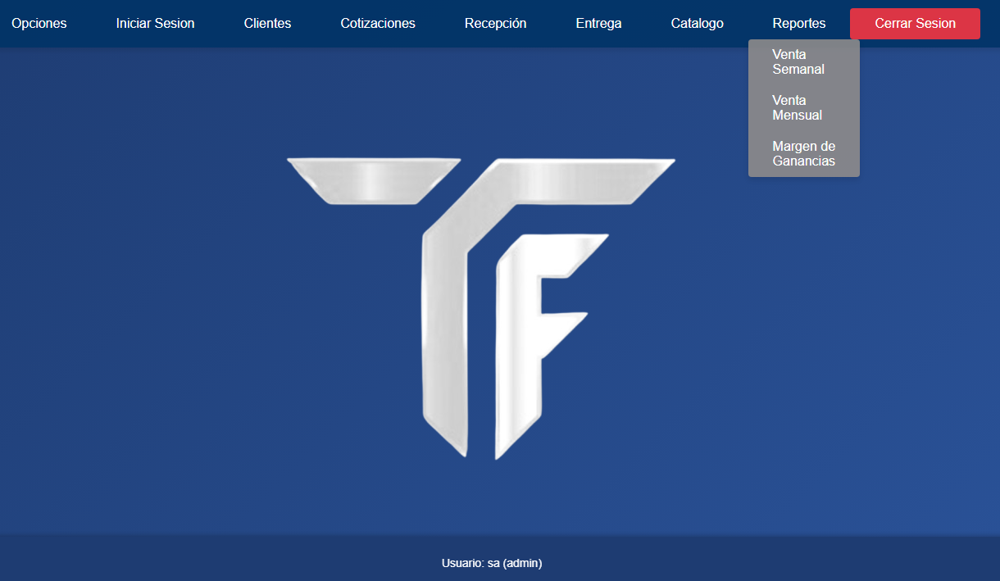
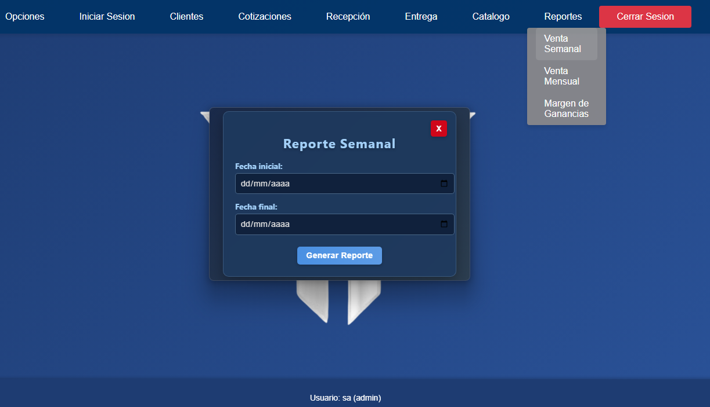
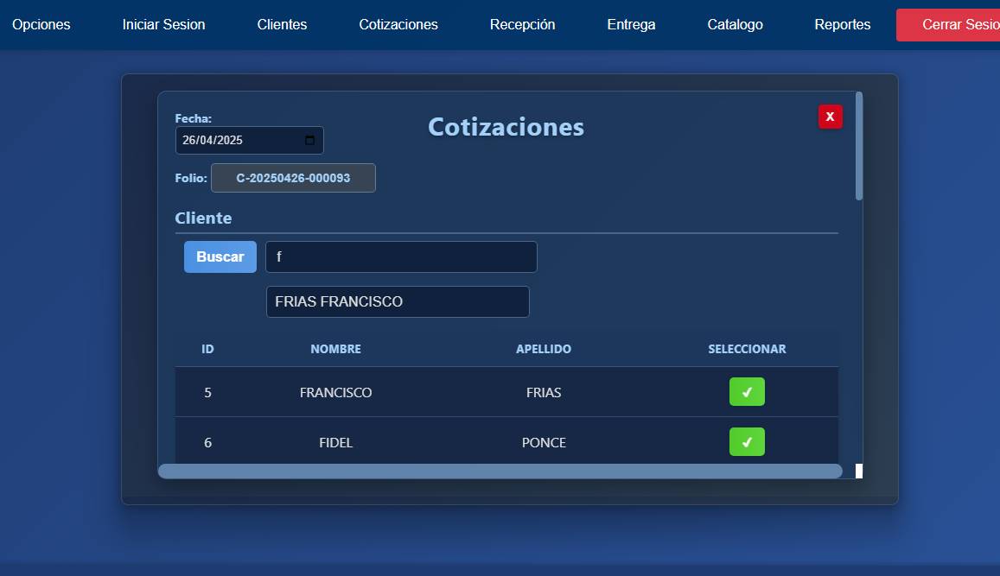
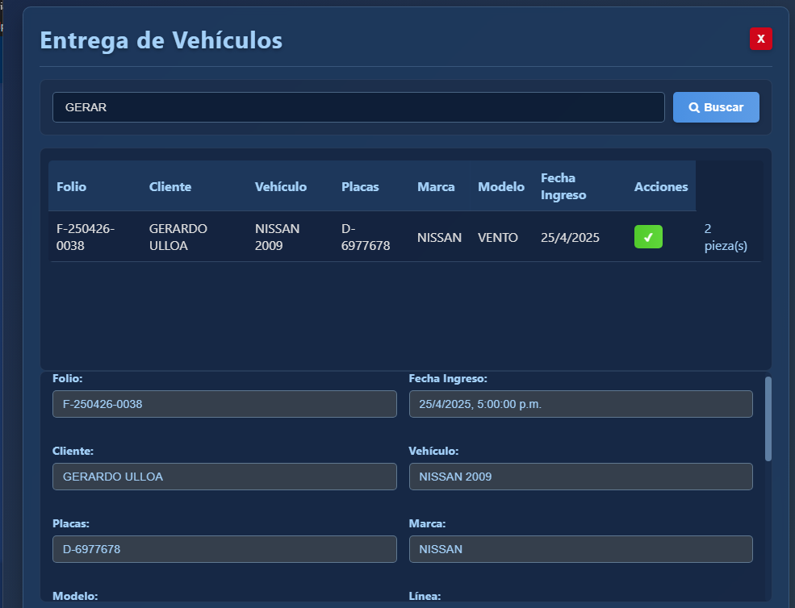
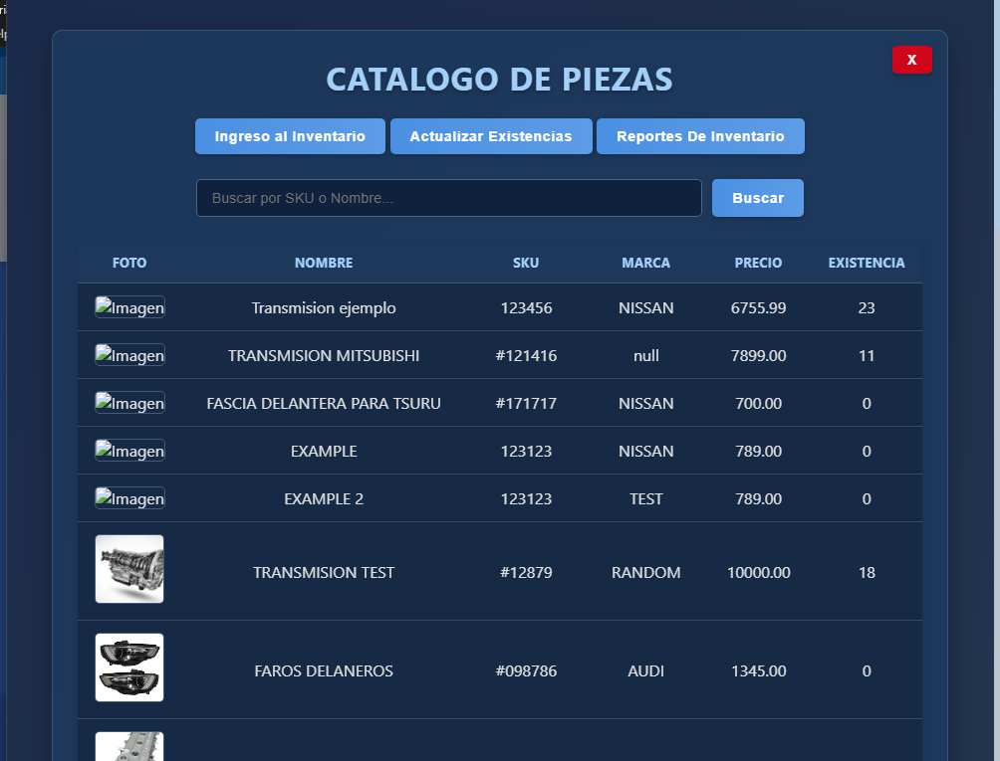
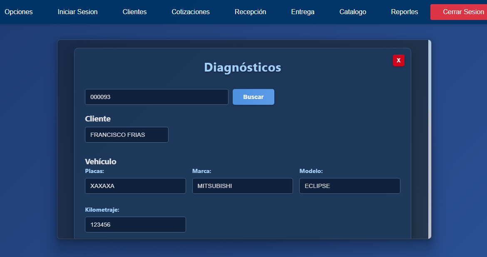
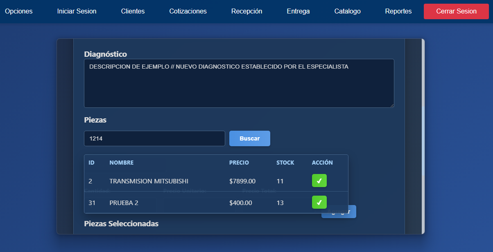

# SEDA - Sistema de Gestión para Taller Automotriz
### SERVICE ENGINE DIAGNOSTIC ASSISTANT (S.E.D.A)

[](https://github.com/Daniel-SotoDev/SEDA/blob/main/LICENSE)
[](https://www.electronjs.org/)
[](https://nodejs.org/)

Sistema integral para la gestión de talleres automotrices especializados en transmisiones, con módulos para:
- Registro de clientes y vehículos
- Diagnóstico técnico
- Cotizaciones y entregas
- Reportes de inventario y ventas

## Características Principales

| Módulo          | Funcionalidades                                                                 |
|-----------------|---------------------------------------------------------------------------------|
| **Clientes**    | Registro completo con múltiples contactos y vehículos asociados                 |
| **Vehículos**   | Historial completo de servicios, kilometraje y especificaciones técnicas       |
| **Diagnóstico** | Sistema detallado con fotos adjuntas y checklist de componentes                |
| **Cotizaciones**| Generación de presupuestos con desglose de piezas y mano de obra               |
| **Inventario**  | Control de stock con alertas de reposición y margen de ganancia                |
| **Reportes**    | Generación de PDF profesional para diagnósticos, cotizaciones y recibos        |

## VISTA PREVIA DEL SISTEMA
<div align="center">
   
   
</div>
<div align="center">
   
   
</div>
<div align="center">
   
   
</div>
<div align="center">
    
    
</div>


## Tecnologías Utilizadas

**Frontend:**
- Electron.js (v35.2.0)
- HTML5, CSS3, JavaScript ES6+
- PDFKit (para generación de documentos)

**Backend:**
- Node.js (v18.x)
- Express.js
- SQL Server (MSSQL)

**Complementos:**
- Socket.IO (Comunicación en tiempo real)
- Electron Forge (Empaquetado)
- Electron Store (Persistencia local)

## Instalación

1. **Clonar repositorio:**
   ```bash
   git clone https://github.com/Daniel-SotoDev/SEDA.git
   cd SEDA

2. **Instalar dependencias**
   ```bash
    npm install

4. **Configuracion**
    Configurar conexion a SQL Server con el archivo DB QUERY.sql, crear la instancia (revisar el archivo)

5. **Ejecucion**
   ```bash
    npm start

**DESPLIEGUE**

*Para crear el ejecutable*

        npm run make

                            
- Se generara un instalador para Windows en la carpeta out\make\squirrel.windows\x64
- Ejecutar el archivo Setup.exe
- Una vez ejecutado ve a la carpeta C:\Users\tu usuario\AppData\Local\transmisiones_frias\app-1.0.0\resources\app
- Buscar el archivo iniciar-app.exe y ejecutalo , tiene que ser en el siguiente orden
- Primero iniciar-app.exe y ya que inicie la aplicacion ejecutar iniciar-servidor.exe 
- INICIAR-SERVIDOR.EXE NO SE DEBE DE CERRAR SOLO MINIMIZAR LA PANTALLA
- Se pueden crear accesos directos al escritorio


 *Requisitos del Sistema:*

-Windows 10/11 (64-bit)
-SQL Server 2019+
-4GB RAM mínimo
-500MB espacio en disco


 *Contacto:*
Daniel Soto - Data Analyst / Software Developer
daniel.sotodev138@gmail.com
www.linkedin.com/in/danielsotodevlp
www.github.com/Daniel-SotoDev
